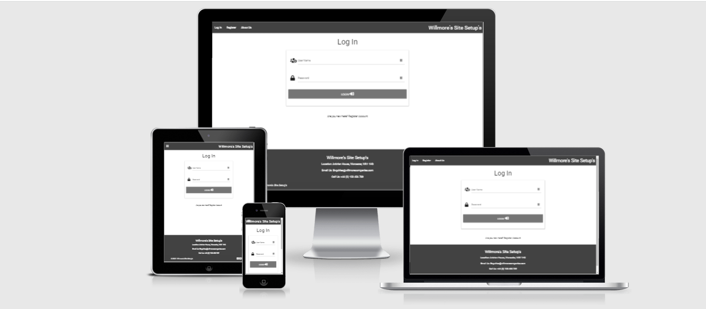

Willmore's Site Setups
---
## Table of Contents

- [**About**](#About)
- [**UX**](#UX)
    - [Goals](#Goals)
    - [User Stories](#User-Stories)
    - [Styling](#Styling)
    - [Wireframes](#Wireframes)
- [**Features**](#Features)
    - [Existing Features](#Existing-Features)
    - [Potential Future Features](#Potential-Future-Features)
- [**Technologies Used**](#Technologies-Used)
- [**Testing**](#Testing)
- [**Deployment**](#Deployment)
    - [Live Website](#Live-Website)
    - [Repository Link](#Repository-Link)
    - [Running Code Locally](#RunningCode)
- [**Credits**](#Credits)

---

## About

The reason as to why I created this website is because I have worked for multiple different companies that do not have a centralised point to manage site installations for IT equipment. 

This has been in the construction industry all the way to working for an MSP. 

The mission was to reduce the amount of backlog and paperwork that is created by all different users trying to add the same information in as well as assigning and tracking tasks. 

The website has the ability for users to edit or delete tasks however this is only doable for their own tasks and not other users. This is managed by an if statement within the tasks.html page.

---

## UX

### Goals

The goals of the website were: 
1. To hold information on what tasks were needed to be done at which location on which date. 
2. The website must allow users to have their own logins instead of using a shared account - this leads to more accountability if a task is not added or completed. 
3. The website must show correctly on all devices from laptops to mobile phones.

---

### User Stories

From the designer's point of view:
- The site needs to be easy to use and navigate around due to the nature of the product. 
- The site needs to be accessible on all devices to ensure that engineers in the field can view it on their phones.
- New tasks must be easy to add to ensure that the user experience is good and not too complex for people to understand. 
- The site needs to be easily modified to allow the creator to sell the site to other companies to bring in revenue. 

From the users point of view:
- I need to be able to add new tasks in without the hassle of navigating through different links.
- I need to be able to add new locations in without navigating through different links.
- I need to be able to edit and delete tasks if I accidentally input it wrong or it's not needed anymore.
- I need to ensure that no one else can delete any of the tasks that I have entered in.

---

### Styling

The website must be easy to read and use whilst ensuring that the different functions are separate from the main colour scheme. I used a plain white background to ensure that nothing is hard to read if I added a picture to the background. To ensure that the colour scheme did not differ I used the same grey in the nav bar, the footer as well as the pop out accordion. I used a red colour for DELETE and a light blue colour for EDIT - this is maintained throughout the entirety of the site. 

For the font, I used Google Font's Roboto with Sans Serif as the backup just in case the Google Fonts did not load.

---

### Wireframes


---

## Features

### Existing Features
- The navigation menu shows at the top of the page with the links on the left hand side however this will shrink to a hamburger icon on smaller devices and show on the left hand side. 
- Users are able to login/register - it will display a message if an incorrect username or password has been entered. It also displays a message if a username already exists in the database.
- Certain links will only show if the user is logged in, there is a link for adding, editing and deleting locations however this has been locked down to either the user "admin" or "lukewillmore". 
- Tasks are written in collapsible headers that popout which can be expanded to view more information in that particular task.
- The footer is fixed to the bottom of the page on all pages.
- The due date field is dd/mmmm/yyyy.
- There is a search function for users to be able to search for current tasks that are in the database. 
- There is an ability for users to edit and delete their own tasks however not other users.

### Features Left to Implement: 
- Completing tasks - this is to ensure that when tasks are completed they do not get deleted.
- More defensive programming - added the below if statement to ensure that a user to has to be logged in before manually navigating to the URL:
```
if "user" in session.keys() == True:
return redirect(url_for("login")
``` 
